# AWS meshPlatform Module

meshStack is a Cloud Foundation Platform by meshcloud. AWS is a proprietary public cloud platform provided by Amazon Web Services. meshStack supports project and user management for AWS to include AWS services into cloud projects managed by meshStack.

This terraform module is used to integrate AWS into a meshStack instance as a meshPlatform. The output of this module is a set of credentials that need to be configured in meshStack as described in [meshcloud public docs](https://docs.meshcloud.io/docs/meshstack.how-to.integrate-meshplatform.html).

<p align="center">
  
</p>

## Prerequisites

- [Terraform installed](https://learn.hashicorp.com/tutorials/terraform/install-cli)
- [AWS CLI installed](https://docs.aws.amazon.com/cli/latest/userguide/getting-started-install.html)

This module assumes you are following landing zone best practices and segregate accounts by function.
To call this module, you will need three `aws` providers set up against different accounts

- management account: organization management account, the account that hosts the AWS Organization
- meshcloud account: meshStack will use this account to host the IAM users used by meshStack
- automation account: meshStack will use this account to manage CloudFormation that are used in [Landing Zones](https://docs.meshcloud.io/docs/meshcloud.landing-zones.html).

Here is how the users and roles for the meshplatform fit together:

```mermaid
graph LR;
    subgraph Organization Account
        meshfedServiceRole("🪖 MeshfedServiceRole");
        costExplorerServiceRole("🪖 MeshCostExplorerServiceRole");
    end
    subgraph meshcloud Account
        replicatorUser["👤 ReplicatorUser & AccessKey"];
        costExplorerUser["👤 CostExplorerUser & AccessKey"];
    end
    replicatorUser--Trusted Entity with External-id-->meshfedServiceRole;
    costExplorerUser--Trusted Entity with External-id-->costExplorerServiceRole;
    subgraph Automation Account
        meshfedAutomationRole("🪖 MeshfedAutomationRole");
    end
    replicatorUser--Trusted Entity with External-id-->meshfedAutomationRole
```



If you're planning to execute the setup manually, one simple way to set up the required providers is by setting up three
different profiles on your AWS CLI and include those IAM users' access and secret keys in your `~/.aws/credentials` file
as described below.

You can also of course set up the `aws` providers any other way you like (e.g. using `assume_role`), as long as you
pass them when calling the meshPlatform module:

```hcl
provider aws {
  alias = "management"
  profile = "management"
}

provider aws {
  alias = "meshcloud"
  profile = "meshcloud"
}

provider aws {
  alias = "automation"
  profile = "automation"
}

module "meshplatform" {
  source = "git::https://github.com/meshcloud/terraform-aws-meshplatform.git"

  providers = {
    aws.management = aws.management
    aws.meshcloud  = aws.meshcloud
    aws.automation = aws.automation
  }

  # set input variables
}
```

## Module Structure

For an overview of the module structure, refer to [generated terraform docs](./TERRAFORM_DOCS.md)

## How to Use This Module

### Using AWS Portal

1. Open AWS CloudShell Service on your management account.[^1]

    - Install terraform into CloudShell.

      ```sh
      # Terminal Commands For Amazon Linux
      sudo yum install -y yum-utils
      sudo yum-config-manager --add-repo https://rpm.releases.hashicorp.com/AmazonLinux/hashicorp.repo
      sudo yum -y install terraform
      ```

    - Configure credentials for AWS CLI.

      ```sh
      cat > ~/.aws/credentials << EOF
      [management]
      aws_access_key_id = XXXX
      aws_secret_access_key = XXXX
      [meshcloud]
      aws_access_key_id = XXXX
      aws_secret_access_key = XXXX
      [automation]
      aws_access_key_id = XXXX
      aws_secret_access_key = XXXX
      EOF
      ```

2. Download the example `main.tf` and `outputs.tf` files.

    ```sh
    # Downloads main.tf and outputs.tf files into ~/terraform-aws-meshplatform
    wget https://raw.githubusercontent.com/meshcloud/terraform-aws-meshplatform/main/examples/basic-aws-integration/main.tf -O ~/terraform-aws-meshplatform/main.tf
    wget https://raw.githubusercontent.com/meshcloud/terraform-aws-meshplatform/main/examples/basic-aws-integration/outputs.tf -O ~/terraform-aws-meshplatform/outputs.tf
    ```

3. Open `~/terraform-aws-meshplatform/main.tf` with a text editor. Modify the module variables and Terraform state backend settings in the file.

4. Execute the module.

    ```sh
    # Changes into ~/terraform-aws-meshplatform and applies terraform
    cd ~/terraform-aws-meshplatform
    terraform init
    terraform apply
    ```

5. Access terraform output and pass it securely to meshcloud.

    ```sh
    # The JSON output contains sensitive values that must not be transmitted to meshcloud in plain text.
    terraform output -json
    ```

## Example Usages

Check [examples](./examples/) for different use cases. As a quick start we recommend using [basic-aws-integration](./examples/basic-aws-integration) example.

[^1]: This How-To guides you through the setup from your Cloudshell. You can also run the terraform scripts on your local machine.
[^2]: You can also use other [ways to assign values input variables](https://www.terraform.io/language/values/variables#assigning-values-to-root-module-variables).

## Contributing Guide

Before opening a Pull Request, we recommend following the below steps to get a faster approval:

1. Install [pre-commit](https://pre-commit.com/#install)

   We use pre-commit to perform several terraform related tasks such as `terraform validate`, `terraform fmt`, and generating terraform docs with `terraform_docs`

2. Execute `pre-commit install`: Hooks configured in `.pre-commit-config.yaml` will be executed automatically on commit. For manual execution, you can use `pre-commit run -a`.

<!-- BEGIN_TF_DOCS -->
## Requirements

| Name | Version |
|------|---------|
| <a name="requirement_aws"></a> [aws](#requirement\_aws) | >= 2.7.0 |

## Providers

| Name | Version |
|------|---------|
| <a name="provider_aws.automation"></a> [aws.automation](#provider\_aws.automation) | 4.57.1 |
| <a name="provider_aws.management"></a> [aws.management](#provider\_aws.management) | 4.57.1 |
| <a name="provider_aws.meshcloud"></a> [aws.meshcloud](#provider\_aws.meshcloud) | 4.57.1 |

## Modules

| Name | Source | Version |
|------|--------|---------|
| <a name="module_automation_account_replicator_access"></a> [automation\_account\_replicator\_access](#module\_automation\_account\_replicator\_access) | ./modules/meshcloud-replicator/replicator-automation-account-access | n/a |
| <a name="module_management_account_metering_access"></a> [management\_account\_metering\_access](#module\_management\_account\_metering\_access) | ./modules/meshcloud-cost-explorer/ce-management-account-access | n/a |
| <a name="module_management_account_replicator_access"></a> [management\_account\_replicator\_access](#module\_management\_account\_replicator\_access) | ./modules/meshcloud-replicator/replicator-management-account-access | n/a |
| <a name="module_meshcloud_account_metering_access"></a> [meshcloud\_account\_metering\_access](#module\_meshcloud\_account\_metering\_access) | ./modules/meshcloud-cost-explorer/ce-meshcloud-account-access | n/a |
| <a name="module_meshcloud_account_replicator_access"></a> [meshcloud\_account\_replicator\_access](#module\_meshcloud\_account\_replicator\_access) | ./modules/meshcloud-replicator/replicator-meshcloud-account-access | n/a |

## Resources

| Name | Type |
|------|------|
| [aws_caller_identity.automation](https://registry.terraform.io/providers/hashicorp/aws/latest/docs/data-sources/caller_identity) | data source |
| [aws_caller_identity.management](https://registry.terraform.io/providers/hashicorp/aws/latest/docs/data-sources/caller_identity) | data source |
| [aws_caller_identity.meshcloud](https://registry.terraform.io/providers/hashicorp/aws/latest/docs/data-sources/caller_identity) | data source |

## Inputs

| Name | Description | Type | Default | Required |
|------|-------------|------|---------|:--------:|
| <a name="input_automation_account_service_role_name"></a> [automation\_account\_service\_role\_name](#input\_automation\_account\_service\_role\_name) | Name of the custom role in the automation account. See https://docs.meshcloud.io/docs/meshstack.how-to.integrate-meshplatform-aws-manually.html#set-up-aws-account-3-automation | `string` | `"MeshfedAutomationRole"` | no |
| <a name="input_aws_enrollment_enabled"></a> [aws\_enrollment\_enabled](#input\_aws\_enrollment\_enabled) | Set to true, to allow meshStack to enroll Accounts via AWS Control Tower for the meshPlatform. | `bool` | `false` | no |
| <a name="input_aws_sso_instance_arn"></a> [aws\_sso\_instance\_arn](#input\_aws\_sso\_instance\_arn) | AWS SSO Instance ARN. Needs to be of the form arn:aws:sso:::instance/ssoins-xxxxxxxxxxxxxxx. Setup instructions https://docs.meshcloud.io/docs/meshstack.aws.sso-setup.html. | `string` | n/a | yes |
| <a name="input_cost_explorer_management_account_service_role_name"></a> [cost\_explorer\_management\_account\_service\_role\_name](#input\_cost\_explorer\_management\_account\_service\_role\_name) | Name of the custom role in the management account used by the cost explorer user. | `string` | `"MeshCostExplorerServiceRole"` | no |
| <a name="input_cost_explorer_meshcloud_account_service_user_name"></a> [cost\_explorer\_meshcloud\_account\_service\_user\_name](#input\_cost\_explorer\_meshcloud\_account\_service\_user\_name) | Name of the user using cost explorer service to collect metering data. | `string` | `"meshcloud-cost-explorer-user"` | no |
| <a name="input_cost_explorer_privileged_external_id"></a> [cost\_explorer\_privileged\_external\_id](#input\_cost\_explorer\_privileged\_external\_id) | Set this variable to a random UUID version 4. The external id is a secondary key to make an AssumeRole API call. | `string` | n/a | yes |
| <a name="input_landing_zone_ou_arns"></a> [landing\_zone\_ou\_arns](#input\_landing\_zone\_ou\_arns) | Organizational Unit ARNs that are used in Landing Zones. We recommend to explicitly list the OU ARNs that meshStack should manage. | `list(string)` | <pre>[<br>  "arn:aws:organizations::*:ou/o-*/ou-*"<br>]</pre> | no |
| <a name="input_management_account_service_role_name"></a> [management\_account\_service\_role\_name](#input\_management\_account\_service\_role\_name) | Name of the custom role in the management account. See https://docs.meshcloud.io/docs/meshstack.how-to.integrate-meshplatform-aws-manually.html#set-up-aws-account-2-management | `string` | `"MeshfedServiceRole"` | no |
| <a name="input_meshcloud_account_service_user_name"></a> [meshcloud\_account\_service\_user\_name](#input\_meshcloud\_account\_service\_user\_name) | Name of the meshfed-service user. This user is responsible for replication. | `string` | `"meshfed-service-user"` | no |
| <a name="input_replicator_privileged_external_id"></a> [replicator\_privileged\_external\_id](#input\_replicator\_privileged\_external\_id) | Set this variable to a random UUID version 4. The external id is a secondary key to make an AssumeRole API call. | `string` | n/a | yes |
| <a name="input_support_root_account_via_aws_sso"></a> [support\_root\_account\_via\_aws\_sso](#input\_support\_root\_account\_via\_aws\_sso) | Set to true to allow meshStack to manage the Organization's AWS Root account's access via AWS SSO. | `bool` | `false` | no |

## Outputs

| Name | Description |
|------|-------------|
| <a name="output_automation_account_id"></a> [automation\_account\_id](#output\_automation\_account\_id) | Automation Account ID |
| <a name="output_cost_explorer_management_account_role_arn"></a> [cost\_explorer\_management\_account\_role\_arn](#output\_cost\_explorer\_management\_account\_role\_arn) | Amazon Resource Name (ARN) of Management Account Role for replicator |
| <a name="output_cost_explorer_privileged_external_id"></a> [cost\_explorer\_privileged\_external\_id](#output\_cost\_explorer\_privileged\_external\_id) | Cost explorer privileged\_external\_id |
| <a name="output_management_account_id"></a> [management\_account\_id](#output\_management\_account\_id) | Management Account ID |
| <a name="output_meshcloud_account_id"></a> [meshcloud\_account\_id](#output\_meshcloud\_account\_id) | Meshcloud Account ID |
| <a name="output_meshstack_access_role_name"></a> [meshstack\_access\_role\_name](#output\_meshstack\_access\_role\_name) | The name for the Account Access Role that will be rolled out to all managed accounts. |
| <a name="output_metering_aws_iam_keys"></a> [metering\_aws\_iam\_keys](#output\_metering\_aws\_iam\_keys) | You can access your credentials when you execute `terraform output metering_aws_iam_keys` command |
| <a name="output_replicator_automation_account_role_arn"></a> [replicator\_automation\_account\_role\_arn](#output\_replicator\_automation\_account\_role\_arn) | Amazon Resource Name (ARN) of Automation Account Role for replicator |
| <a name="output_replicator_aws_iam_keys"></a> [replicator\_aws\_iam\_keys](#output\_replicator\_aws\_iam\_keys) | You can access your credentials when you execute `terraform output replicator_aws_iam_keys` command |
| <a name="output_replicator_management_account_role_arn"></a> [replicator\_management\_account\_role\_arn](#output\_replicator\_management\_account\_role\_arn) | Amazon Resource Name (ARN) of Management Account Role for replicator |
| <a name="output_replicator_privileged_external_id"></a> [replicator\_privileged\_external\_id](#output\_replicator\_privileged\_external\_id) | Replicator privileged\_external\_id |
<!-- END_TF_DOCS -->
